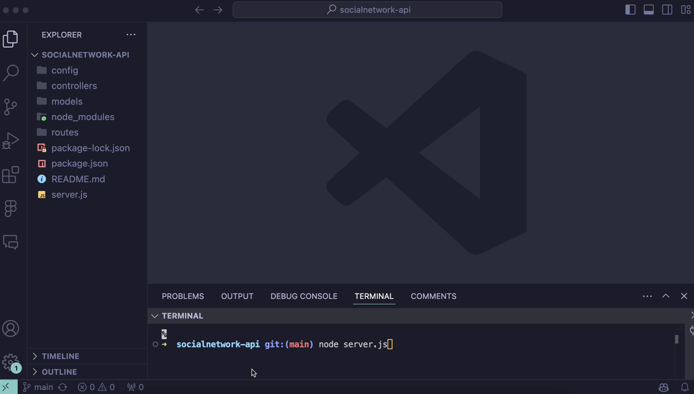

# socialnetwork-api

## description

 This app is an API for a social network web application where users can share their thoughts, react to friends’ thoughts, and create a friend list. Express.js is used for routing, a MongoDB database, and the Mongoose ODM. In addition to using the Express.js and Mongoose packages, you may also optionally use a JavaScript date library of your choice or the native JavaScript Date object to format timestamps.

 ## table of contents
 
 * [description](#description)
 * [installation](#installation)
 * [usage](#usage)

 ## installation

 1. Run npm i to install all packages!
 2. Run node server.js
 
 ## usage

 Once the server is started, and the API server running port is listening - feel free to test each route found in the controllers files in insomnia to ensure all users, friends, thoughts and reactions can be seen, updated and removed. The walkthrough vide below can show you how this works.

 ## walk-through video

## license

MIT

A short and simple permissive license with conditions only requiring preservation of copyright and license notices. Licensed works, modifications, and larger works may be distributed under different terms and without source code.

